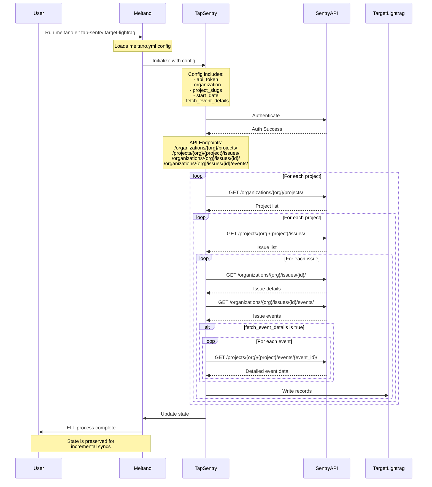

# tap-sentry

This is a [Singer](https://singer.io) tap that extracts data from the [Sentry API](https://docs.sentry.io/api/) and produces JSON-formatted data following the [Singer spec](https://github.com/singer-io/getting-started/blob/master/SPEC.md).

## Installation

```bash
pip install tap-sentry
```

## Configuration

This tap requires a `config.json` file which specifies:

```json
{
  "api_token": "YOUR_SENTRY_API_TOKEN",
  "start_date": "2020-01-01T00:00:00Z",  // date to start syncing from
  "base_url": "https://sentry.io/api/0/",  // optional, default shown
  "organization": "your-organization-slug"  // optional, defaults to "split-software"
}
```

To generate a Sentry API token, visit your Sentry organization settings and create a new API token with the appropriate permissions.

### Configuration Options

| Parameter | Required | Default | Description |
|-----------|----------|---------|-------------|
| api_token | Yes | | Your Sentry API token |
| start_date | Yes | | Date to start syncing data from (ISO-8601 format) |
| base_url | No | https://sentry.io/api/0/ | Your Sentry instance URL (for self-hosted or regional instances) |
| organization | No | split-software | Your Sentry organization slug |

## Usage

```bash
# Discovery mode
tap-sentry --config config.json --discover > catalog.json

# Sync mode with catalog
tap-sentry --config config.json --catalog catalog.json

# With debug logging
tap-sentry --config config.json --catalog catalog.json -v
```

## Supported Streams

| Stream | Key Properties | Schema |
| ------ | ------------- | ------ |
| Projects | id | Information about Sentry projects |
| Issues | id | Error issues tracked in Sentry |
| Events | eventID | Individual error events |
| Teams | id | Team information |
| Users | id | User information |
| Releases | version | Release information |
| Project Detail | id | Detailed project information including settings, statistics, and configurations |
| Release | id | Release information including versions, commits, and deployments |

## Stream Details

### project_detail

The project_detail stream provides detailed information about each Sentry project. Unlike the basic projects stream, this includes comprehensive details about project settings, configurations, and statistics.

**Note**: This stream is processed in a non-async manner due to the detailed nature of the API calls.

### release

The release stream provides information about releases in your Sentry projects, including:
- Version information
- Commit data
- Deployment status
- Project associations
- Release statistics

**Note**: This stream is processed in a non-async manner.

## Replication

This tap uses [Sentry's REST API](https://docs.sentry.io/api/) and tracks bookmark information to enable incremental sync for supported streams:

- Issues: Incremental sync based on start date
- Events: Incremental sync based on start date
- Releases: Incremental sync based on start date
- Projects: Full table sync
- Teams: Full table sync
- Users: Full table sync

## State

This tap maintains state in the format:

```json
{
  "bookmarks": {
    "issues": {
      "start": "2023-01-01T00:00:00Z" 
    },
    "events": {
      "start": "2023-01-01T00:00:00Z"
    },
    "releases": {
      "start": "2023-01-01T00:00:00Z"
    }
  }
}
```

## Debugging

This tap supports debug logging which shows detailed information about API requests and responses. To enable debug logging, use the `-v` flag or set the environment variable `SINGER_LOG_LEVEL=DEBUG`.

The debug logs include:
- Request URLs with parameters
- Response status codes
- Pagination details
- Error information

## Meltano Integration

You can easily use this tap with Meltano by adding the following to your `meltano.yml`:

```yaml
plugins:
  extractors:
    - name: tap-sentry
      namespace: tap_sentry
      pip_url: tap-sentry
      executable: tap-sentry
      capabilities:
        - catalog
        - discover
        - state
      settings:
        - name: api_token
          kind: password
          label: Sentry API Token
          description: Bearer token for Sentry API authentication
          protected: true
        - name: start_date
          kind: date_iso8601
          label: Start Date
          description: The earliest record date to sync
          value: '2020-01-01T00:00:00Z'
        - name: base_url
          kind: string
          label: Sentry API Base URL
          description: Base URL for Sentry API (for self-hosted or regional instances)
          value: 'https://sentry.io/api/0/'
        - name: organization
          kind: string
          label: Sentry Organization
          description: Your Sentry organization slug
          value: 'split-software'
      select:
        - projects.*
        - issues.*
        - events.*
        - teams.*
        - users.*
        - releases.*
        - project_detail.*
        - release.*
```
# Sequence diagram


## Sentry API Endpoints

The tap uses the following Sentry API endpoints:

1. **Projects List**
   - Endpoint: `/organizations/{organization_slug}/projects/`
   - Purpose: Fetch all projects for an organization

2. **Project Issues**
   - Endpoint: `/projects/{organization_slug}/{project_slug}/issues/`
   - Purpose: Fetch all issues for a specific project

3. **Issue Detail**
   - Endpoint: `/organizations/{organization_slug}/issues/{issue_id}/`
   - Purpose: Get detailed information about a specific issue

4. **Issue Events**
   - Endpoint: `/organizations/{organization_slug}/issues/{issue_id}/events/`
   - Purpose: Get all events associated with a specific issue

5. **Project Events**
   - Endpoint: `/projects/{organization_slug}/{project_slug}/events/`
   - Purpose: Get all events for a specific project

6. **Event Detail**
   - Endpoint: `/projects/{organization_slug}/{project_slug}/events/{event_id}/`
   - Purpose: Get detailed information about a specific event

7. **Teams**
   - Endpoint: `/organizations/{organization_slug}/teams/`
   - Purpose: Get all teams in an organization

8. **Users**
   - Endpoint: `/organizations/{organization_slug}/users/`
   - Purpose: Get all users in an organization

9. **Releases**
   - Endpoint: `/organizations/{organization_slug}/releases/`
   - Purpose: Get all releases for an organization

## Data Flow

1. The tap first fetches all projects for the configured organization
2. For each project, it fetches all issues
3. For each issue:
   - Fetches issue details
   - Fetches all events associated with the issue
   - If `fetch_event_details` is enabled, fetches detailed data for each event
4. All records are written to the target system
5. State is maintained for incremental syncs

## Error Handling

The tap includes error handling for common HTTP errors:
- 404 Not Found: Handled gracefully for missing resources
- 429 Rate Limit: Included in tolerated errors
- Other errors are logged with detailed information

## Incremental Sync

The tap supports incremental syncs using bookmarks for:
- Issues
- Events
- Teams
- Users
- Releases

Each stream maintains its own state to ensure efficient data extraction in subsequent runs.

## Limitations

1. Rate Limiting: Sentry API has rate limits that need to be respected
2. Event History: Some events might not be available after a certain time period
3. Project Access: The API token must have appropriate permissions for all projects
4. Data Volume: Large organizations with many events might need to consider data volume and sync frequency

## Development

```bash
# Install in development mode
pip install -e .

# Run tests
python -m unittest discover tests
```

### Testing

This tap has unit tests in the `tests/` directory. To run them:

```bash
python -m unittest discover tests
```

## License

MIT
```