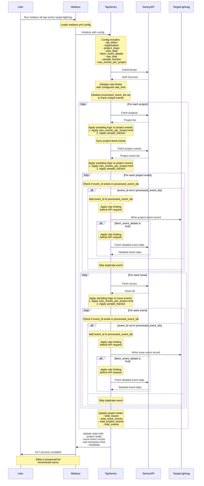

```mermaid
sequenceDiagram
    participant User
    participant Meltano
    participant TapSentry
    participant SentryAPI
    participant TargetLightrag

    User->>Meltano: Run meltano elt tap-sentry target-lightrag
    Note over Meltano: Loads meltano.yml config
    
    Meltano->>TapSentry: Initialize with config
    Note over TapSentry: Config includes:<br/>- api_token<br/>- organization<br/>- project_slugs<br/>- start_date<br/>- fetch_event_details<br/>- rate_limit<br/>- sample_fraction<br/>- max_events_per_project
    
    TapSentry->>SentryAPI: Authenticate
    SentryAPI-->>TapSentry: Auth Success
    
    Note over TapSentry: Initialize rate limiter<br/>with configured rate_limit
    
    Note over TapSentry: Initialize processed_event_ids set<br/>to track unique events
    
    loop For each project
        TapSentry->>SentryAPI: Fetch projects
        SentryAPI-->>TapSentry: Project list
        
        Note over TapSentry: Apply sampling logic to project events:<br/>1. Apply max_events_per_project limit<br/>2. Apply sample_fraction
        
        Note over TapSentry: Sync project-level events
        TapSentry->>SentryAPI: Fetch project events
        SentryAPI-->>TapSentry: Project event list
        
        Note over TapSentry: Apply sampling logic to project events:<br/>1. Apply max_events_per_project limit<br/>2. Apply sample_fraction
        
        loop For each project event
            Note over TapSentry: Check if event_id exists in processed_event_ids
            alt event_id not in processed_event_ids
                Note over TapSentry: Add event_id to processed_event_ids
                Note over TapSentry: Apply rate limiting<br/>before API request
                TapSentry->>TargetLightrag: Write project event record
                
                alt fetch_event_details is true
                    Note over TapSentry: Apply rate limiting<br/>before API request
                    TapSentry->>SentryAPI: Fetch detailed event data
                    SentryAPI-->>TapSentry: Detailed event data
                end
            else
                Note over TapSentry: Skip duplicate event
            end
        end
        
        loop For each issue
            TapSentry->>SentryAPI: Fetch issues
            SentryAPI-->>TapSentry: Issue list
            
            Note over TapSentry: Apply sampling logic to issue events:<br/>1. Apply max_events_per_project limit<br/>2. Apply sample_fraction
            
            loop For each event
                Note over TapSentry: Check if event_id exists in processed_event_ids
                alt event_id not in processed_event_ids
                    Note over TapSentry: Add event_id to processed_event_ids
                    Note over TapSentry: Apply rate limiting<br/>before API request
                    TapSentry->>TargetLightrag: Write issue event record
                    
                    alt fetch_event_details is true
                        Note over TapSentry: Apply rate limiting<br/>before API request
                        TapSentry->>SentryAPI: Fetch detailed event data
                        SentryAPI-->>TapSentry: Detailed event data
                    end
                else
                    Note over TapSentry: Skip duplicate event
                end
            end
        end
        
        Note over TapSentry: Update project totals:<br/>- total_issues<br/>- total_issue_events<br/>- total_project_events<br/>- total_events
    end
    
    TapSentry->>Meltano: Update state with:<br/>- project totals<br/>- issue event counts<br/>- last extraction time<br/>- metadata
    Meltano->>User: ELT process complete

    Note over User,Meltano: State is preserved for<br/>incremental syncs
``` 