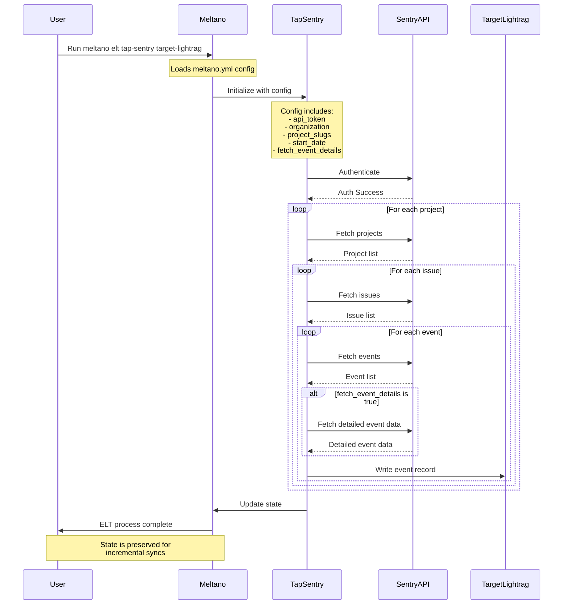

```mermaid
sequenceDiagram
    participant User
    participant Meltano
    participant TapSentry
    participant SentryAPI
    participant TargetLightrag

    User->>Meltano: Run meltano elt tap-sentry target-lightrag
    Note over Meltano: Loads meltano.yml config
    
    Meltano->>TapSentry: Initialize with config
    Note over TapSentry: Config includes:<br/>- api_token<br/>- organization<br/>- project_slugs<br/>- start_date<br/>- fetch_event_details
    
    TapSentry->>SentryAPI: Authenticate
    SentryAPI-->>TapSentry: Auth Success
    
    loop For each project
        TapSentry->>SentryAPI: Fetch projects
        SentryAPI-->>TapSentry: Project list
        
        loop For each issue
            TapSentry->>SentryAPI: Fetch issues
            SentryAPI-->>TapSentry: Issue list
            
            loop For each event
                TapSentry->>SentryAPI: Fetch events
                SentryAPI-->>TapSentry: Event list
                
                alt fetch_event_details is true
                    TapSentry->>SentryAPI: Fetch detailed event data
                    SentryAPI-->>TapSentry: Detailed event data
                end
                
                TapSentry->>TargetLightrag: Write event record
            end
        end
    end
    
    TapSentry->>Meltano: Update state
    Meltano->>User: ELT process complete

    Note over User,Meltano: State is preserved for<br/>incremental syncs
``` 